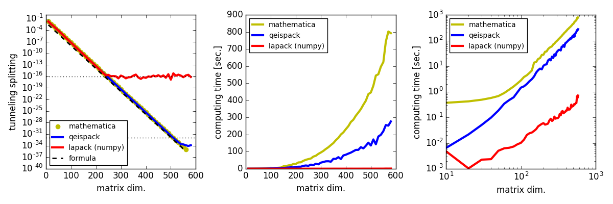
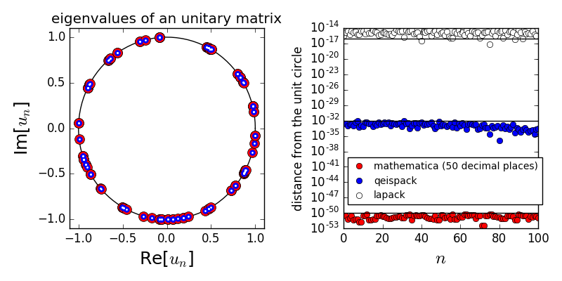

# QEISPACK

QEISPACK is a modified [fortrun90 eispack library](https://people.sc.fsu.edu/~jburkardt/f_src/eispack/eispack.html) which calculates the eigenvalues and eigenvectors of a matrix in the quadruple precision.
Note that the test has NOT been completed even in the latest version.

## Requirement

- gfortrun (>=4.7) (or the other fortrun compiler which supports quadruple precision computing)

## Usage

    gfortrun -c qeispack.f90

## Related multiple precision programs

- [mpmath](http://mpmath.org/)
- [MPACK](http://mplapack.sourceforge.net/)

## Demo
   
- the evaluation for the energy gap (tunnel splitting) in a Hamiltonian system by using double precision Lapack (numpy), Mathematica (100 digits precision) and qeispack (quadruple precision).

- the eigenvalues for an unitary matrix 

## Examples and Tests:

- test_qeispack_prb1.f90 is a test program that calculates eigenvalues and eigenvectors of a complex general matrix.
- now preparing...

Compile:
    
    gfortrun -o test qeispack.o test_qeispack_prb1.f90

## Licence 

This program is distribued under GNU Lesser General Public License (GNU LGPL)

## Support

Author has been supported by JSPS KAKENHI Grants No. 16K17767
      