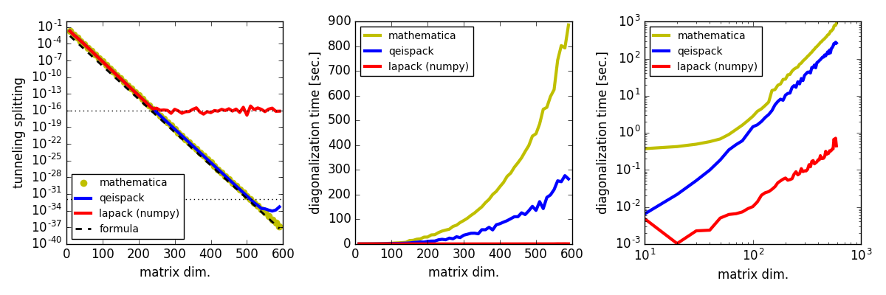

# QEISPACK

QEISPACK is a modified [fortrun90 eispack library](https://people.sc.fsu.edu/~jburkardt/f_src/eispack/eispack.html) which calculates the eigenvalues and eigenvectors of a matrix in the quadruple precision.
Note that the test has NOT been completed even in the latest version.

## Requirement

- gfortrun (>=4.7) (or the other fortrun compiler which supports quadruple precision computing)

## Usage

   gfortrun -c qeispack.f90

## Comparison
   
   the evaluation for the energy gap (tunnel splitting) in the Hamiltonian system by using 
   double precision Lapack (numpy), Mathematica (100 digits precision) and qeispack (quadruple precision).
   

## Examples and Tests:

   now preparing...
   
## Support

Author has been supported by JSPS KAKENHI Grants No. 16K17767
      